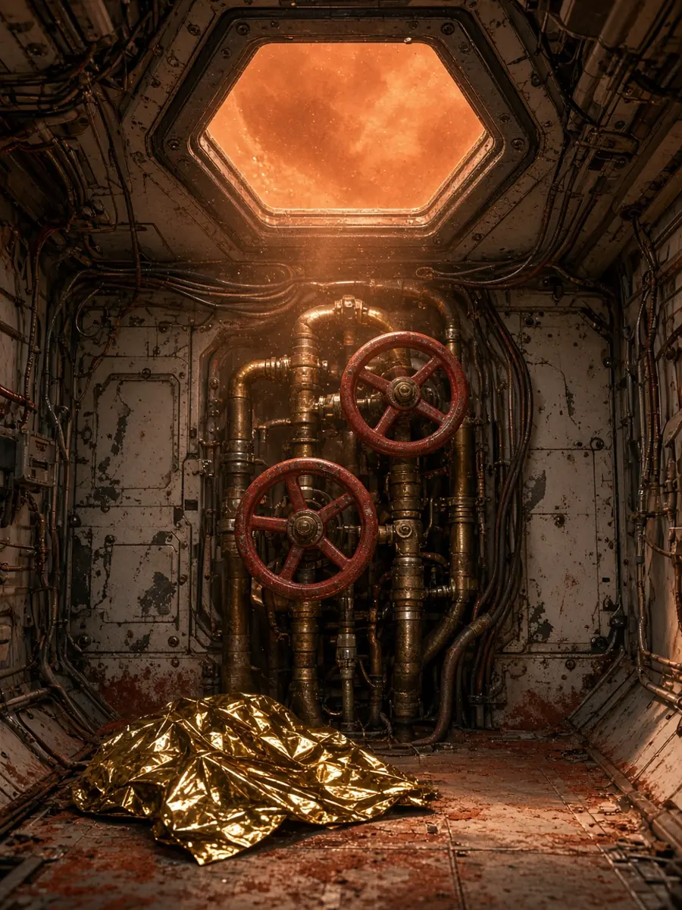

# CROSSTALK

**Four phones. Four opposite alerts. Power tells oxygen to kill the pump. Oxygen says absolutely not.**

A 90-second, same-table party game for 4 phones. Like *Keep Talking and Nobody Explodes*, except you cannot shout the answer at the person holding the bomb. You send them a picture.



## The idea

Each person types a **username** on the way in. That name is who they are — on the roster, on every ask, on the debrief. Seats are jobs, not identities:

| Seat | Unique fact | Can send |
|---|---|---|
| **Oxygen** | Oxygen mix on each switch | Nothing. Every control. Pictures land as notices |
| **Power** | Voltage / draw | `PUMP OFF` · `PUMP ON` |
| **Navigation** | Storm clock · which rock cluster | `SHIELDS` **or** `SHOOT` — one is enough |
| **Communications** | Alarm log | `SEAL PORT` · `SEAL STBD` |

Every seat also sees cabin oxygen and reactor power. Those two bars are the argument. The unique facts are what you have to say out loud. **Multiplayer is not a mode** — if one screen held every readout there would be nothing to relay. The written track justification is in [`WHY-MULTIPLAYER.md`](./WHY-MULTIPLAYER.md).

Power, navigation and communications can shout across the table all they like. **They have to** — at each other. The ship will not name what broke, and nobody's screen carries anyone else's number. The only thing that officially reaches oxygen is a **picture landing as a notice on their phone**, signed with the sender's username. Every picture is welded to exactly one console. Communications is the only seat that can send the leaking valve. Power is the only one who can see the reactor draw spike. Navigation is the only one who can see the storm clock. All three share one cooldown that gets shorter as the hab comes apart, so a wasted press is wasted for everybody.

You do not need earplugs. People will hear the table anyway. The pictures are the channel so the game still works in a noisy room.

So the game is: diagnose out loud, work out whose call it is, then fire one picture at Vega before the air runs out.

Emergencies stack instead of taking turns. The leak is still open when the pump runs away. The runaway is still going when the storm is called. Late, the first valve opens again. Vega can't perceive any of it on her own. **There is still one order that survives.** Any seat that goes quiet kills the hab.

Oxygen does not tap got-it. Flipping the matching switch is the reply — the sender's line goes green when the control actually moves. Everything else oxygen wants to say, they say out loud. The block on that seat is one-directional.

Cabin air is not a mystery gauge. Each switch has its own oxygen number (pump, port, starboard, shields, guns). The big % is those added up, plus a leftover cabin mix for trouble that is not labeled.

## Run it

Requires Node 20.19+ or 22.12+.

```bash
npm install
npm run dev
```

Open **http://127.0.0.1:43127**

If the table has never played, tap **60-second briefing** first. One phone. You sit in each seat, send a picture, and feel the alerts contradict. Then open a hab.

## Play with real people

Only **one** machine runs the server. Everyone else joins it over the same Wi‑Fi.

1. One laptop: `npm run dev`
2. Find its LAN IP — macOS `ipconfig getifaddr en0`, Windows `ipconfig`, Linux `ip addr`
3. Everyone opens `http://THAT_IP:43127` on their phone
4. Everyone types a **username**. One person taps **open a hab**, reads the 4-letter code aloud, everyone else **climbs aboard**
5. Take seats, everyone marks ready, hab lead launches. A 3-2-1, then ninety seconds.
6. After the horn, the debrief shows who sent what and what you missed. Hab lead taps **same hab — run it again**. Swap seats. Oxygen should rotate.

Empty crew seats get a slow stand-in so two or three people can still play. Four humans is the real game.

Two `npm run dev` processes means two separate habs that can't see each other. Just one.

Allow the firewall prompt on first run. If device-to-device traffic is blocked (common on campus and hotel Wi‑Fi), tether everything to a phone hotspot.

Empty seats are covered by the sim, so you can test alone or with two.

### Three house rules

The software enforces the channel — oxygen's client is never sent the ship's voice, and the crew have no text input to that phone. These three are on you:

- **Watch the screen, not the table.** The official order is the picture, even if you can hear people shouting.
- Nobody hands oxygen their phone.
- Everyone gets a turn as oxygen.

## Voice and urgency

The phones are not quiet. A rumble, a pulse, and a klaxon sit under the round and get worse as `chaos` climbs. Vega's glass thuds when a picture hits. Idris hears the front come in. The last fifteen seconds tick. None of that is a leak — each seat only sonifies numbers it can already see. Speech is still crew-only.

The ship talks. This works with no setup — it uses the browser's built-in speech engine, and Vega's phone is never sent a speech event in the first place.

For better audio (and the xAI sponsor angle), set a key **on the host machine only**:

```bash
XAI_API_KEY=xai-... npm run dev
```

The key stays server-side and is proxied through `/api/voice`, so it never ships to a phone. Check which path is live with `curl localhost:43128/api/health`. When Grok audio is used it gets a band-pass filter so it sounds like a suit radio.

## Layout

```
server/game.ts       the whole simulation — air, power, storm, the 3 emergencies
server/index.ts      socket plumbing + the voice proxy
shared/              types and copy, imported by both sides
src/roles/           one file per console
src/components/      SVG instruments: air gauge, storm scope, power cells
WHY-MULTIPLAYER.md   why this is the multiplayer track
CROSSTALK-SOURCE.txt every source file concatenated for submission
scripts/asymmetry.ts asserts unique facts stay on one console
scripts/playtest.ts  headless balance harness
```

## Check it still works

```bash
npm run check
```

Typecheck, lint, then the two harnesses below. Worth running before you present.

### Is the asymmetry intact?

```bash
npm run asymmetry
```

Asserts the rule the whole game rests on: the ship's voice never routes to oxygen, every seated phone gets the shared air and power bars, unique facts stay welded to one console, and a signal sent from the wrong seat is refused. This is a correctness check, not a tuning one — if a unique field leaks the game quietly becomes solitaire, and that has already happened once.

### Is the balance still right?

```bash
npm run playtest
```

Simulates crews at different reaction speeds, then silences each player in turn, then silences each individual call. It asserts the things the design depends on: relaying in the right order survives, no seat can be left empty, and no call is decoration.

```
=== the one path ===
all three, sharp (1.2s)        won 8/8   air floor  17
all three, normal (2.2s)       won 8/8   air floor   7
all three, slow (3.6s)         won 8/8   air floor   2
all three, sloppy (5.0s)       won 0/8   air floor   0
all three + Vega on her gauge  won 8/8   air floor   5

=== every seat is load-bearing ===
Rook silent (no pump calls)    won 0/8   air floor   0
Idris silent (no storm calls)  won 0/8   air floor   0
Chen silent (no valve calls)   won 0/8   air floor   0
nobody signals at all          won 0/8   air floor  28
Vega alone, playing her gauge  won 0/8   air floor   0

=== storm is a choice, pump-off is not ===
only SHOOT (no shields)        won 8/8
only SHIELDS (no shoot)        won 8/8
storm never answered           won 0/8
pump-off never called          won 0/8
```

Two of those rows are the interesting ones. **Vega alone** is a Vega who ignores the pad and plays her air gauge as well as anyone could — she still dies every time, because two of the three emergencies are invisible to her. And **sloppy (5.0s)** is where the cliff is: a crew that dawdles by another second and a half over the slow crew goes from 8/8 to 0/8.

If you want to soften it for a demo, the dials that matter are `MISSION_SECONDS` in `shared/content.ts` and the starting air in `server/game.ts`. Lower starting air is *not* a difficulty knob — it drops the cabin below the overpressure ceiling and turns the pump runaway into free air, which inverts the whole design.
